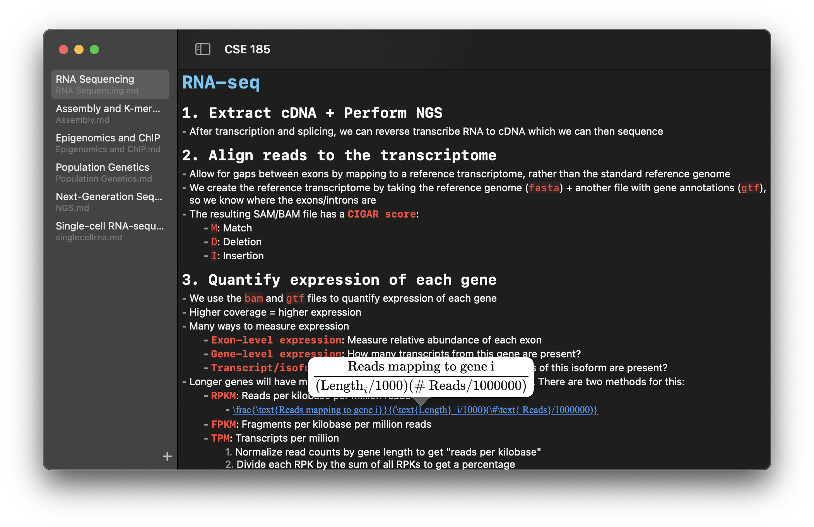

# Notedown

A (very work-in-progress) SwiftUI, AppKit, and UIKit-based Markdown editor that runs on macOS and iOS. It aims to provide a hybrid experience that brings together the speed of raw Markdown and LaTeX editing with the comforts of WYSIWYG editors.

The goal of Notedown is to create a simple, unified note-taking application that allows for easy formatting and reading using Markdown and LaTeX. It was born out of my frustration with other note-taking applications like OneNote and how obtuse and slow their interfaces can be - sometimes, plain old markdown and LaTeX are all you need.

Other markdown editors work, but they all work on a dual-pane design that requires you to write markdown on one pane and view the compiled markdown in another, which is distracting and cluttered. It takes up too much room on the screen, and basic things like syncing scroll locations between the editor and preview never seem to work.

By unifying the markdown editor and preview into a sort of "hybrid" interface, Notedown aims to afford the speed and precision that Markdown and LaTeX provide with the comforts that WYSIWYG editors provide.

It's in its very early stages at the moment, but some of the future goals include:
- Better syntax autocomplete
- More customizability (font, syntax highlighting, etc)
